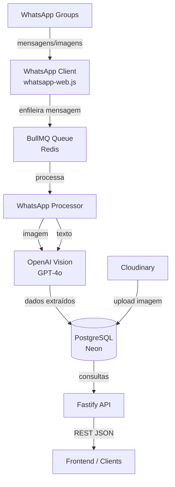
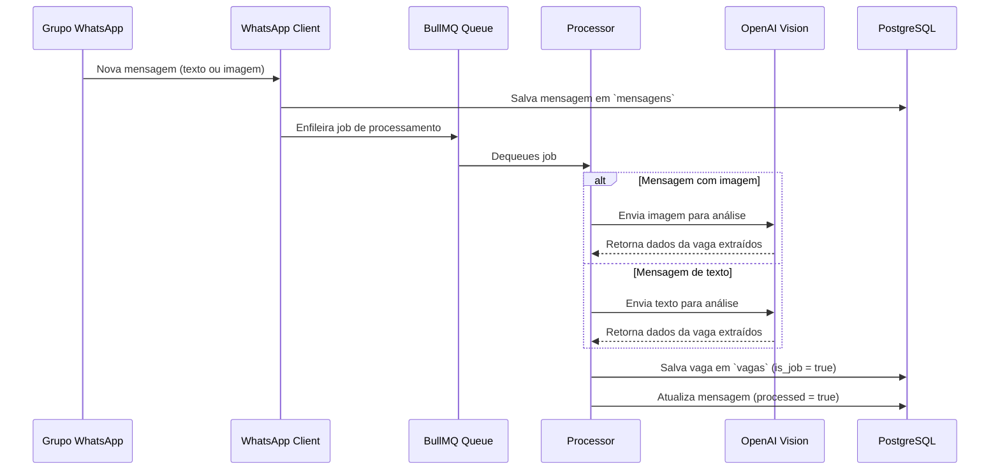
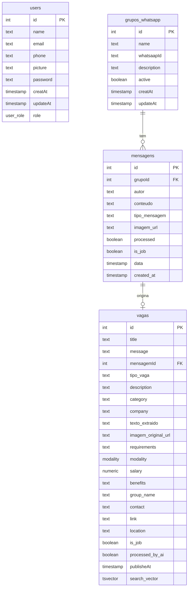
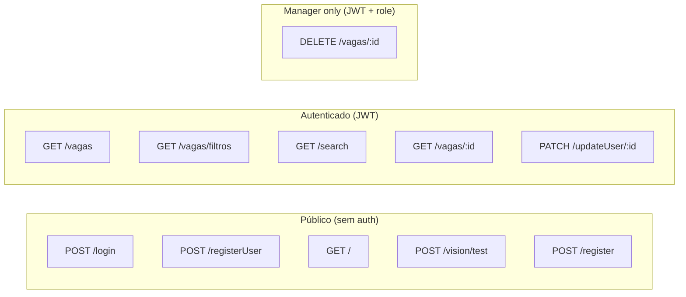

# Sistema de Filtros de Vagas do WhatsApp

API REST para captura, análise com IA e filtragem automática de vagas de emprego enviadas em grupos do WhatsApp.

---

## Visão Geral da Arquitetura



---

## Stack

| Camada | Tecnologia |
|---|---|
| Runtime | Node.js + TypeScript |
| Framework | Fastify 5 |
| Validação | Zod + fastify-type-provider-zod |
| ORM | Drizzle ORM |
| Banco de dados | PostgreSQL (Neon Serverless) |
| Autenticação | JWT (jsonwebtoken) |
| Hash de senha | Argon2 |
| Fila | BullMQ + Redis (ioredis) |
| IA / Visão | OpenAI (GPT-4o Vision) |
| Upload de imagens | Cloudinary |
| WhatsApp | whatsapp-web.js |
| Testes | Vitest + Supertest |
| Linter/Formatter | Biome |

---

## Fluxo de Processamento de Mensagens



---

## Banco de Dados



---

## Endpoints da API



---

## Referência dos Endpoints

### Autenticação

#### `POST /login`
Autentica um usuário e retorna um JWT.

**Body:**
```json
{
  "email": "user@example.com",
  "password": "string"
}
```

**Respostas:**
| Status | Corpo |
|---|---|
| 200 | `{ "token": "jwt_string" }` |
| 400 | `{ "error": "Credencias inválidas, verifique se o email ou senha estao corretos." }` |

---

### Usuários

#### `POST /registerUser`
Cria um novo usuário.

**Body:**
```json
{
  "name": "string (min 4 chars)",
  "email": "user@example.com",
  "phone": "string",
  "password": "string",
  "role": "user | manager (opcional, default: user)"
}
```

**Respostas:**
| Status | Corpo |
|---|---|
| 201 | `{ "message": "Usuario cadastrado com sucesso", "usersId": 1 }` |
| 409 | `{ "duplicate": "Email ja esta cadastrado" }` |

---

#### `PATCH /updateUser/:id` 🔒
Atualiza dados do usuário. Requer JWT.

**Params:** `id` (number)

**Body:**
```json
{
  "email": "string (opcional)",
  "password": "string (opcional)",
  "phone": "string (opcional)",
  "picture": "url (opcional)"
}
```

**Respostas:**
| Status | Corpo |
|---|---|
| 200 | `{ "message": "Usuario atualizado com sucesso" }` |
| 404 | `{ "error": "Usuario nao encontrado" }` |
| 409 | `{ "emailExist": "Email ja esta cadastrado" }` |

---

### Vagas

#### `POST /register`
Cria uma vaga manualmente.

**Body:**
```json
{
  "is_job": true,
  "title": "string (opcional)",
  "description": "string (opcional)",
  "category": "string (opcional)",
  "company": "string (opcional)",
  "modality": "Remoto | Hibrido | Presencial | Home Office (opcional)",
  "salary": 5000,
  "location": "string (opcional)",
  "contact": "string (opcional)",
  "link": "url (opcional)"
}
```

**Respostas:**
| Status | Corpo |
|---|---|
| 201 | `{ "message": "Vaga cadastrada com sucesso", "vagaId": 1 }` |

---

#### `GET /vagas` 🔒
Lista vagas com paginação. Requer JWT.

**Query params:** `page` (default: 1), `limit` (default: 10)

**Resposta 200:**
```json
{
  "vagas": [{ "id": 1, "title": "...", "modality": "Remoto", "..." : "..." }],
  "total": 100,
  "page": 1,
  "hasMore": true
}
```

---

#### `GET /vagas/filtros` 🔒
Filtra vagas por critérios. Requer JWT.

**Query params:** `category`, `modality`, `tipo_vaga`, `location`, `publisheAt`

---

#### `GET /search` 🔒
Busca full-text nas vagas. Requer JWT.

**Query params:** `q` (obrigatório), `page`, `limit` (max: 100)

**Resposta 200:**
```json
{
  "vagas": [{ "id": 1, "title": "...", "..." : "..." }],
  "total": 5
}
```

---

#### `GET /vagas/:id` 🔒
Retorna uma vaga pelo ID. Requer JWT.

---

#### `DELETE /vagas/:id` 🔒👑
Remove uma vaga. Requer JWT com role `manager`.

---

### Vision / IA

#### `POST /vision/test`
Faz upload de uma imagem e extrai dados de vaga via IA (OpenAI GPT-4o).

**Content-Type:** `multipart/form-data`  
**Campo:** arquivo de imagem (png, jpg, jpeg, gif, webp — max 10MB)

**Resposta 200 (é uma vaga):**
```json
{
  "success": true,
  "data": {
    "is_job": true,
    "title": "Desenvolvedor Backend",
    "company": "Empresa X",
    "modality": "Remoto",
    "salary": 8000,
    "location": "São Paulo"
  }
}
```

**Resposta 200 (não é uma vaga):**
```json
{
  "success": false,
  "message": "Não é vaga"
}
```

---

## Autenticação

O JWT deve ser enviado no header de todas as rotas protegidas:

```
Authorization: Bearer <token>
```

O payload do token contém:
```json
{
  "sub": 1,
  "role": "user | manager"
}
```

---

## Instalação e Execução

```bash
# Instalar dependências
npm install

# Configurar variáveis de ambiente
cp .env.example .env

# Gerar e aplicar migrations
npm run db:generate
npm run db:migrate

# Popular banco com dados iniciais
npm run db:seed

# Rodar em desenvolvimento
npm run dev

# Rodar testes
npm run test

# Build de produção
npm run start
```

---

## Variáveis de Ambiente

```env
DATABASE_URL=          # URL do PostgreSQL (Neon)
JWT_SECRET=            # Chave secreta para JWT
REDIS_URL=             # URL do Redis
OPENAI_API_KEY=        # Chave da OpenAI
CLOUDINARY_CLOUD_NAME= # Nome do cloud no Cloudinary
CLOUDINARY_API_KEY=    # API Key do Cloudinary
CLOUDINARY_API_SECRET= # API Secret do Cloudinary
```

---

## Scripts disponíveis

| Script | Descrição |
|---|---|
| `npm run dev` | Servidor em modo watch (tsx) |
| `npm run start` | Servidor em produção (dist/) |
| `npm run test` | Roda todos os testes com coverage |
| `npm run db:generate` | Gera migrations com Drizzle Kit |
| `npm run db:migrate` | Aplica migrations no banco |
| `npm run db:studio` | Abre Drizzle Studio |
| `npm run db:seed` | Popula o banco com dados iniciais |
| `npm run format` | Formata código com Biome |

---

## Documentação Interativa

Com o servidor rodando, acesse:

```
http://localhost:3000/docs
```

Powered by [Scalar](https://scalar.com/) + OpenAPI.
