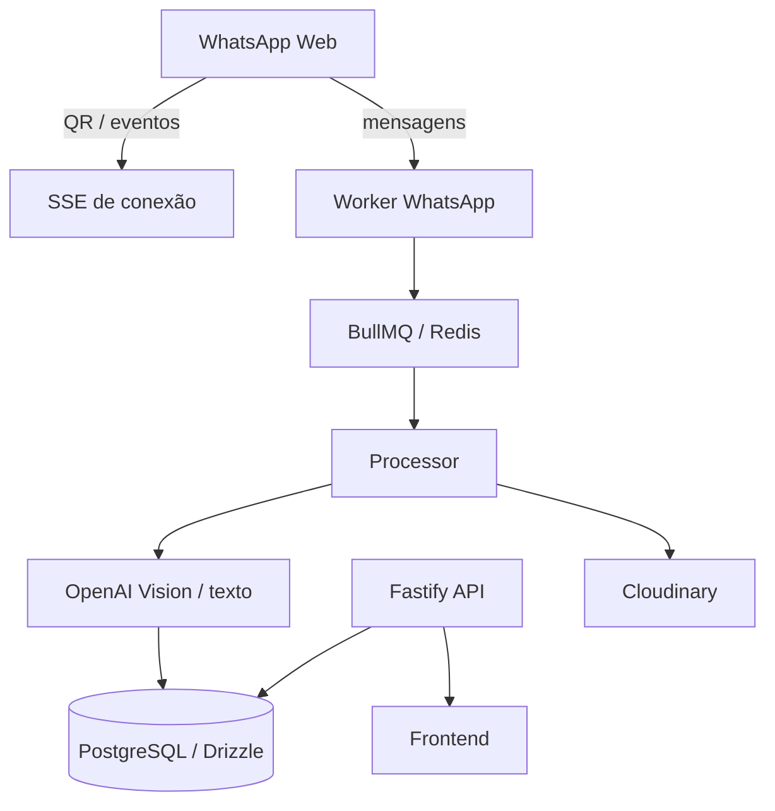
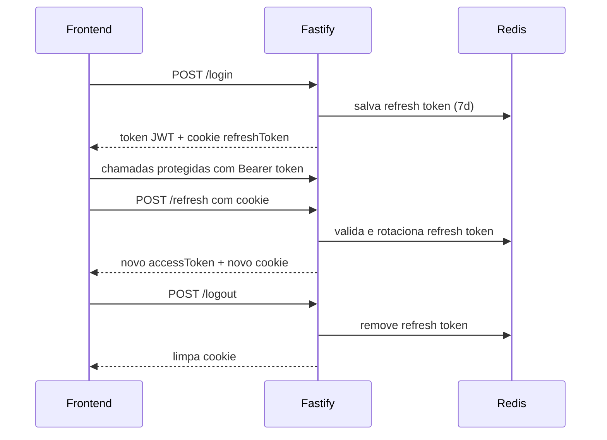
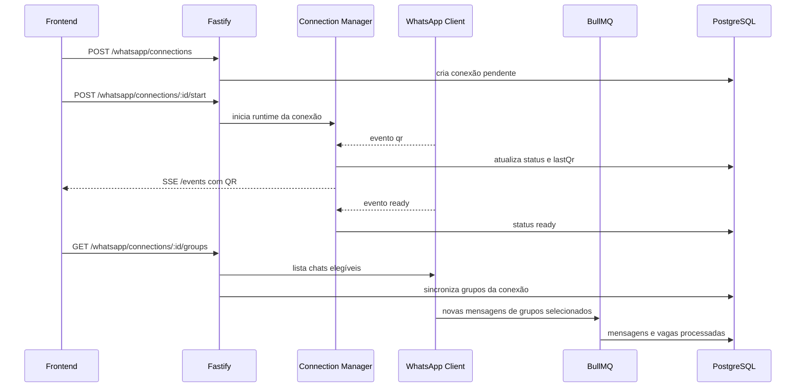
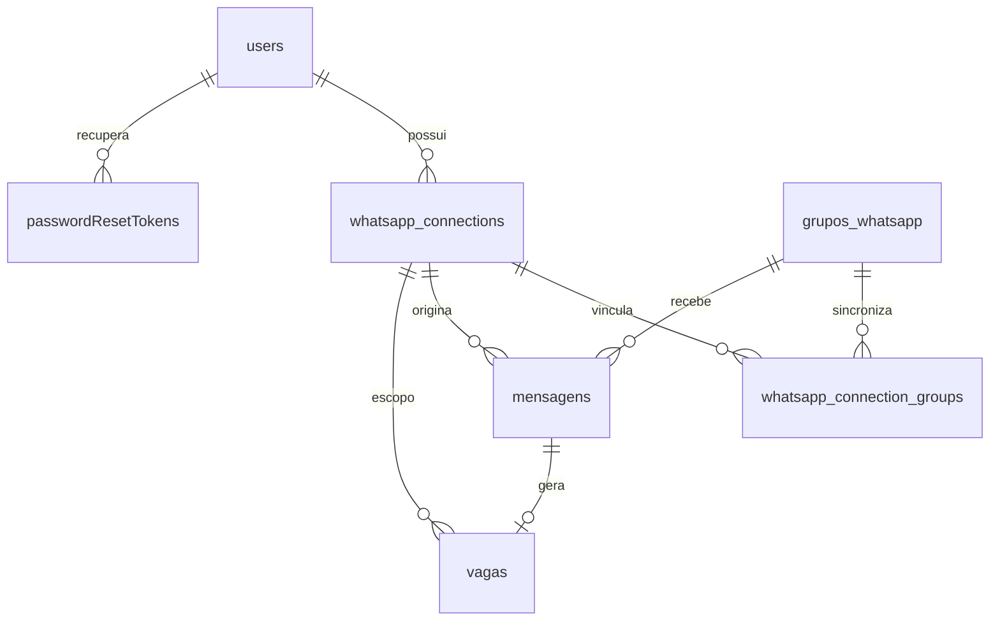

# Sistema de Filtros de Vagas do WhatsApp

API REST para capturar mensagens de grupos do WhatsApp, identificar vagas com IA, persistir os dados em PostgreSQL e expor tudo por endpoints Fastify. O projeto suporta autenticação com refresh token em cookie e múltiplas conexões de WhatsApp por usuário.

---

## Visão geral



### Implementações adicionadas recentemente

- Autenticação com access token JWT de `30m` e refresh token rotativo de `7d`.
- Refresh token armazenado em cookie `httpOnly`.
- Endpoint de `refresh` e endpoint de `logout` com invalidação em Redis.
- Recuperação de senha por token com envio de e-mail.
- Suporte a múltiplas conexões de WhatsApp por usuário.
- SSE para acompanhar QR Code e status de conexão em tempo real.
- Vínculo entre conexões, grupos sincronizados, mensagens processadas e vagas geradas.

---

## Stack

| Camada | Tecnologia |
|---|---|
| Runtime | Node.js + TypeScript |
| Framework | Fastify 5 |
| Validação | Zod + fastify-type-provider-zod |
| ORM | Drizzle ORM |
| Banco de dados | PostgreSQL |
| Cache / fila | Redis + BullMQ |
| Autenticação | JWT + cookies + Redis |
| Hash de senha | Argon2 |
| WhatsApp | whatsapp-web.js |
| IA | OpenAI |
| Upload de imagens | Cloudinary |
| E-mail | Resend |
| Testes | Vitest + Supertest |
| Formatação | Biome |

---

## Fluxo de autenticação



### Regras atuais

- `POST /login` retorna `{ "token": "..." }`.
- O refresh token não volta no JSON; ele é gravado no cookie `refreshToken`.
- `POST /refresh` retorna `{ "accessToken": "..." }` e rotaciona o cookie.
- `POST /logout` remove o token no Redis e limpa o cookie.
- As rotas protegidas aceitam `Authorization: Bearer <token>`.
- O servidor está com CORS habilitado para `FRONTEND_URL` e `credentials: true`.

---

## Fluxo WhatsApp multiusuário



### Como funciona hoje

- Cada usuário pode criar várias conexões WhatsApp.
- Cada conexão possui um `clientKey` único para isolar a sessão do `LocalAuth`.
- O QR Code e os eventos de status são entregues via Server-Sent Events.
- Os grupos são sincronizados por conexão e podem ser marcados como selecionados.
- Mensagens de grupos selecionados são enfileiradas, processadas pela IA e podem gerar registros em `vagas`.

---

## Banco de dados

As tabelas centrais do fluxo atual são:

- `users`
- `passwordResetTokens`
- `whatsapp_connections`
- `whatsapp_connection_groups`
- `grupos_whatsapp`
- `mensagens`
- `vagas`



### Campos adicionados no fluxo de WhatsApp

- `whatsapp_connections.status`: `pending | qr_ready | authenticated | ready | disconnected | failed`
- `whatsapp_connections.lastQr`: último QR emitido para a conexão
- `mensagens.connectionId`: vincula a mensagem à conexão que a recebeu
- `vagas.connectionId`: vincula a vaga à conexão que a originou
- `whatsapp_connection_groups.selected`: define quais grupos da conexão estão ativos para captura

---

## Endpoints principais

### Infra / documentação

| Método | Rota | Descrição |
|---|---|---|
| `GET` | `/` | Health básico da API |
| `GET` | `/docs` | Documentação interativa via Scalar |

### Autenticação e usuários

| Método | Rota | Auth | Descrição |
|---|---|---|---|
| `POST` | `/registerUser` | Não | Cria um usuário |
| `POST` | `/login` | Não | Autentica e retorna access token |
| `POST` | `/refresh` | Cookie | Renova access token e rotaciona refresh token |
| `POST` | `/logout` | Cookie | Invalida refresh token e limpa cookie |
| `POST` | `/forgot-password` | Não | Gera token de recuperação e envia e-mail |
| `POST` | `/reset-password` | Não | Redefine senha com token válido |
| `PATCH` | `/updateUser/:id` | Sim | Atualiza usuário |

### Vagas

| Método | Rota | Auth | Descrição |
|---|---|---|---|
| `POST` | `/register` | Não | Cadastra vaga manualmente |
| `GET` | `/vagas` | Sim | Lista vagas com paginação |
| `GET` | `/vagas/filtros` | Sim | Filtra vagas |
| `GET` | `/search` | Sim | Busca full-text em vagas |
| `GET` | `/vagas/:id` | Sim | Busca vaga por ID |
| `DELETE` | `/vagas/:id` | Sim + manager | Remove vaga |

### Visão / IA

| Método | Rota | Auth | Descrição |
|---|---|---|---|
| `POST` | `/vision/test` | Não | Faz upload de imagem e extrai dados de vaga |

### WhatsApp

| Método | Rota | Auth | Descrição |
|---|---|---|---|
| `GET` | `/whatsapp/connections` | Sim | Lista conexões do usuário |
| `POST` | `/whatsapp/connections` | Sim | Cria uma nova conexão pendente |
| `POST` | `/whatsapp/connections/:id/start` | Sim | Inicia a sessão WhatsApp e dispara QR |
| `GET` | `/whatsapp/connections/:id/events` | Sim | Stream SSE com QR e status |
| `GET` | `/whatsapp/connections/:id/groups` | Sim | Sincroniza grupos e canais elegíveis |
| `POST` | `/whatsapp/connections/:id/groups/select` | Sim | Marca os grupos selecionados |
| `POST` | `/whatsapp/connections/:id/disconnect` | Sim | Desconecta a sessão |

---

## Exemplos de payload

### `POST /login`

```json
{
  "email": "user@example.com",
  "password": "123456"
}
```

Resposta `200`:

```json
{
  "token": "jwt_access_token"
}
```

### `POST /refresh`

Resposta `200`:

```json
{
  "accessToken": "novo_jwt_access_token"
}
```

### `POST /registerUser`

```json
{
  "name": "Maria Souza",
  "email": "maria@example.com",
  "phone": "5511999999999",
  "password": "123456",
  "role": "user"
}
```

### `POST /whatsapp/connections`

Resposta `201`:

```json
{
  "id": 1,
  "status": "pending",
  "clientKey": "wa-1-uuid"
}
```

### `GET /whatsapp/connections/:id/events`

Exemplo de eventos SSE:

```text
event: status
data: {"status":"pending","qr":null}

event: qr
data: {"status":"qr_ready","qr":"base64-ou-texto-do-qr"}

event: status
data: {"status":"ready"}
```

### `POST /whatsapp/connections/:id/groups/select`

```json
{
  "groupIds": [1, 2, 3]
}
```

---

## Execução local

```bash
npm install
npm run db:migrate
npm run db:seed
npm run dev
```

### Scripts disponíveis

| Script | Descrição |
|---|---|
| `npm run dev` | Sobe o servidor com `tsx watch` |
| `npm run start` | Executa a versão compilada |
| `npm run test` | Roda a suíte com coverage |
| `npm run format` | Formata o projeto com Biome |
| `npm run db:generate` | Gera migrations com Drizzle |
| `npm run db:migrate` | Aplica migrations |
| `npm run db:studio` | Abre o Drizzle Studio |
| `npm run db:seed` | Popula dados iniciais |

---

## Variáveis de ambiente

```env
DATABASE_URL=
JWT_SECRET=
REDIS_URL=
FRONTEND_URL=
OPENAI_API_KEY=
RESEND_API_KEY=
CLOUDINARY_CLOUD_NAME=
CLOUDINARY_API_KEY=
CLOUDINARY_API_SECRET=
```

### Observações

- `FRONTEND_URL` é usado no CORS e na montagem do link de recuperação de senha.
- `REDIS_URL` é obrigatório para refresh token e BullMQ.
- `OPENAI_API_KEY` e credenciais do Cloudinary são necessárias para o fluxo de IA com imagem.

---

## Documentação interativa

Com a aplicação rodando, acesse:

```text
http://localhost:3000/docs
```

---

## Testes

O projeto possui cobertura automatizada para os fluxos principais, incluindo:

- autenticação
- recuperação de senha
- rotas de vagas
- rotas e runtime do módulo WhatsApp
- processamento de mensagens e persistência de vagas

Para rodar tudo:

```bash
npm run test
```
